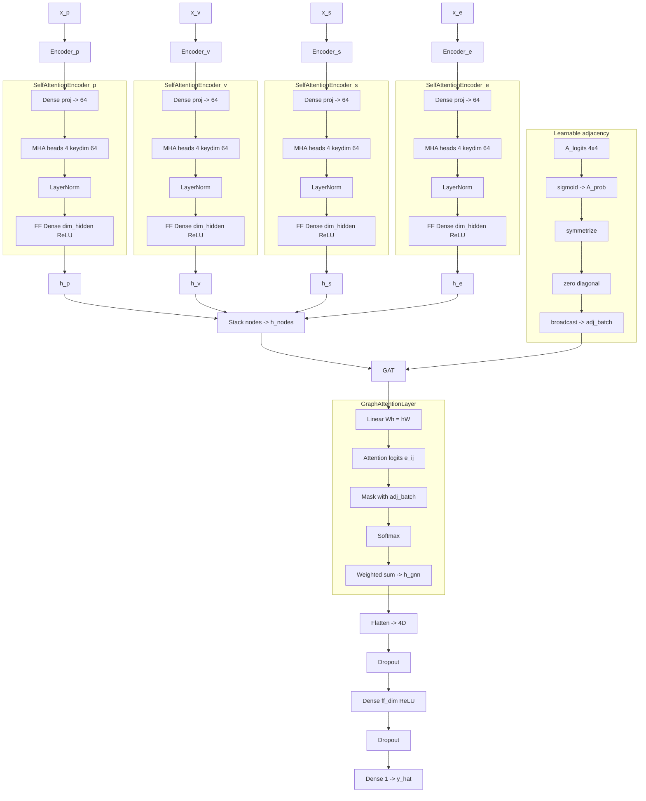

```mermaid
graph TD
    Xp[x_p] --> EncP[Encoder_p]
    Xv[x_v] --> EncV[Encoder_v]
    Xs[x_s] --> EncS[Encoder_s]
    Xe[x_e] --> EncE[Encoder_e]

    subgraph SAGP[SelfAttentionEncoder_p]
        P1[Dense proj -> 64] --> P2[MHA heads 4 keydim 64] --> P3[LayerNorm] --> P4[FF Dense dim_hidden ReLU]
    end

    subgraph SAGV[SelfAttentionEncoder_v]
        V1[Dense proj -> 64] --> V2[MHA heads 4 keydim 64] --> V3[LayerNorm] --> V4[FF Dense dim_hidden ReLU]
    end

    subgraph SAGS[SelfAttentionEncoder_s]
        S1[Dense proj -> 64] --> S2[MHA heads 4 keydim 64] --> S3[LayerNorm] --> S4[FF Dense dim_hidden ReLU]
    end

    subgraph SAGE[SelfAttentionEncoder_e]
        E1[Dense proj -> 64] --> E2[MHA heads 4 keydim 64] --> E3[LayerNorm] --> E4[FF Dense dim_hidden ReLU]
    end

    EncP --> P1
    EncV --> V1
    EncS --> S1
    EncE --> E1

    P4 --> Hp[h_p]
    V4 --> Hv[h_v]
    S4 --> Hs[h_s]
    E4 --> He[h_e]

    Hp --> Stack[Stack nodes -> h_nodes]
    Hv --> Stack
    Hs --> Stack
    He --> Stack

    subgraph ADJ[Learnable adjacency]
        A0[A_logits 4x4] --> A1[sigmoid -> A_prob]
        A1 --> A2[symmetrize]
        A2 --> A3[zero diagonal]
        A3 --> A4[broadcast -> adj_batch]
    end

    Stack --> GAT0[GAT]
    A4 --> GAT0

    subgraph GATB[GraphAttentionLayer]
        G1[Linear Wh = hW] --> G2[Attention logits e_ij]
        G2 --> G3[Mask with adj_batch]
        G3 --> G4[Softmax]
        G4 --> G5[Weighted sum -> h_gnn]
    end

    GAT0 --> G1

    G5 --> Flat[Flatten -> 4D]
    Flat --> M1[Dropout]
    M1 --> M2[Dense ff_dim ReLU]
    M2 --> M3[Dropout]
    M3 --> Out[Dense 1 -> y_hat]
```
