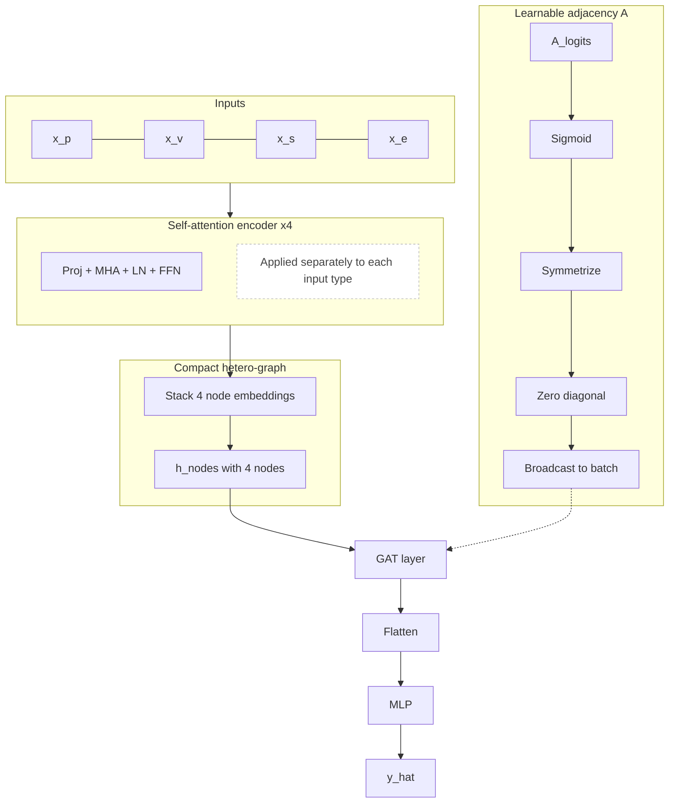

```mermaid
flowchart TD
  %% ===== Inputs =====
  subgraph IN[Inputs]
    direction LR
    Xp[x_p] --- Xv[x_v] --- Xs[x_s] --- Xe[x_e]
  end

  %% ===== Encoders (collapsed) =====
  subgraph ENC[Self-attention encoder x4]
    direction TB
    E0[Proj + MHA + LN + FFN]
    Note1[Applied separately to each input type]:::note
  end

  %% ===== Node stack =====
  subgraph STK[Compact hetero-graph]
    direction TB
    S1[Stack 4 node embeddings]
    S2[h_nodes with 4 nodes]
  end

  %% ===== Learnable adjacency =====
  subgraph ADJ[Learnable adjacency A]
    direction TB
    A0[A_logits]
    A1[Sigmoid]
    A2[Symmetrize]
    A3[Zero diagonal]
    A4[Broadcast to batch]
    A0 --> A1 --> A2 --> A3 --> A4
  end

  %% ===== Message passing + Head =====
  GAT[GAT layer]
  FLT[Flatten]
  MLP[MLP]
  OUT[y_hat]

  %% ===== Data flow =====
  IN --> ENC --> S1 --> S2 --> GAT --> FLT --> MLP --> OUT

  %% ===== Parameter flow (dashed) =====
  A4 -.-> GAT

  %% ===== Styling =====
  classDef note fill:#ffffff,stroke:#bbbbbb,stroke-dasharray: 3 3,color:#444444;
```
