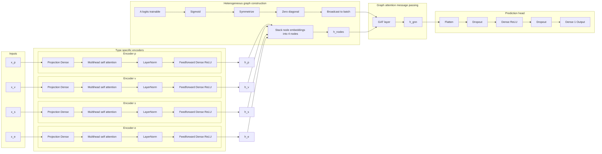

```mermaid
graph LR

%% =========================
%% Inputs
%% =========================
subgraph IN[Inputs]
direction TB
Xp[x_p] 
Xv[x_v] 
Xs[x_s] 
Xe[x_e]
end

%% =========================
%% Encoders
%% =========================
subgraph ENC[Type specific encoders]
direction TB

subgraph EP[Encoder p]
direction LR
EP1[Projection Dense] --> EP2[Multihead self attention] --> EP3[LayerNorm] --> EP4[Feedforward Dense ReLU]
end

subgraph EV[Encoder v]
direction LR
EV1[Projection Dense] --> EV2[Multihead self attention] --> EV3[LayerNorm] --> EV4[Feedforward Dense ReLU]
end

subgraph ES[Encoder s]
direction LR
ES1[Projection Dense] --> ES2[Multihead self attention] --> ES3[LayerNorm] --> ES4[Feedforward Dense ReLU]
end

subgraph EE[Encoder e]
direction LR
EE1[Projection Dense] --> EE2[Multihead self attention] --> EE3[LayerNorm] --> EE4[Feedforward Dense ReLU]
end

end

Xp --> EP1
Xv --> EV1
Xs --> ES1
Xe --> EE1

EP4 --> Hp[h_p]
EV4 --> Hv[h_v]
ES4 --> Hs[h_s]
EE4 --> He[h_e]

%% =========================
%% Graph construction
%% =========================
subgraph GRAPH[Heterogeneous graph construction]
direction TB
STACK[Stack node embeddings into 4 nodes] --> HN[h_nodes]
ALOG[A logits trainable] --> AP[Sigmoid] --> AS[Symmetrize] --> AZ[Zero diagonal] --> AB[Broadcast to batch]
end

Hp --> STACK
Hv --> STACK
Hs --> STACK
He --> STACK

%% =========================
%% GAT message passing
%% =========================
subgraph MP[Graph attention message passing]
direction LR
HN --> G0[GAT layer] --> HG[h_gnn]
AB --> G0
end

%% =========================
%% Predictor
%% =========================
subgraph PRED[Prediction head]
direction LR
HG --> FLAT[Flatten] --> D1[Dropout] --> FC[Dense ReLU] --> D2[Dropout] --> OUT[Dense 1 Output]
end
```
