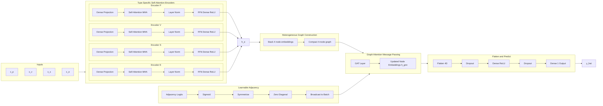

```mermaid
flowchart LR
    subgraph INPUTS[Inputs]
        direction TB
        Xp[x_p] 
        Xv[x_v]
        Xs[x_s]
        Xe[x_e]
    end

    INPUTS --> ENC

    subgraph ENC[Type Specific Self-Attention Encoders]
        direction TB
        subgraph EP[Encoder P]
            direction LR
            EP1[Dense Projection] --> EP2[Self-Attention MHA] --> EP3[Layer Norm] --> EP4[FFN Dense ReLU]
        end
        subgraph EV[Encoder V]
            direction LR
            EV1[Dense Projection] --> EV2[Self-Attention MHA] --> EV3[Layer Norm] --> EV4[FFN Dense ReLU]
        end
        subgraph ES[Encoder S]
            direction LR
            ES1[Dense Projection] --> ES2[Self-Attention MHA] --> ES3[Layer Norm] --> ES4[FFN Dense ReLU]
        end
        subgraph EE[Encoder E]
            direction LR
            EE1[Dense Projection] --> EE2[Self-Attention MHA] --> EE3[Layer Norm] --> EE4[FFN Dense ReLU]
        end
    end

    EP4 --> HN[h_p]
    EV4 --> HN[h_v]
    ES4 --> HN[h_s]
    EE4 --> HN[h_e]

    HN --> STACK

    subgraph STACK[Heterogeneous Graph Construction]
        direction LR
        S1[Stack 4 node embeddings] --> S2[Compact 4-node graph]
    end

    subgraph ADJ[Learnable Adjacency]
        direction LR
        A0[Adjacency Logits] --> A1[Sigmoid] --> A2[Symmetrize] --> A3[Zero Diagonal] --> A4[Broadcast to Batch]
    end

    S2 --> GAT
    A4 --> GAT

    subgraph GAT[Graph Attention Message Passing]
        direction LR
        G1[GAT Layer] --> G2[Updated Node Embeddings h_gnn]
    end

    GAT --> FLAT

    subgraph FLAT[Flatten and Predict]
        direction LR
        F1[Flatten 4D] --> F2[Dropout] --> F3[Dense ReLU] --> F4[Dropout] --> F5[Dense 1 Output]
    end

    FLAT --> OUT[y_hat]
```
