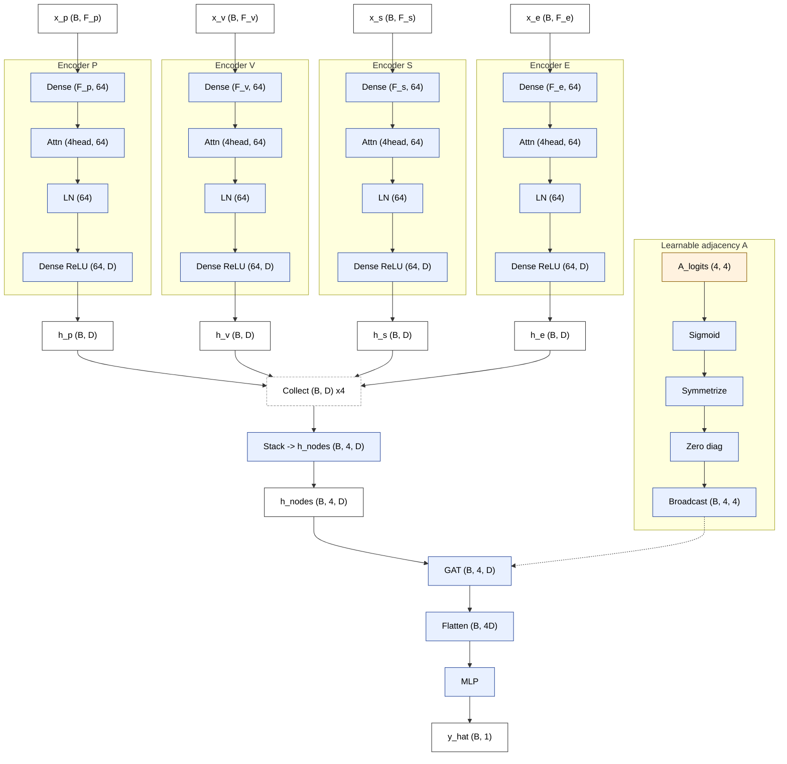

```mermaid
graph TD

  Xp["x_p (B, F_p)"]:::obj
  Xv["x_v (B, F_v)"]:::obj
  Xs["x_s (B, F_s)"]:::obj
  Xe["x_e (B, F_e)"]:::obj

  subgraph EP["Encoder P"]
    direction LR
    P1["Dense (F_p, 64)"]:::fn --> P2["Attn (4head, 64)"]:::fn --> P3["LN (64)"]:::fn --> P4["Dense ReLU (64, D)"]:::fn
  end

  subgraph EV["Encoder V"]
    direction LR
    V1["Dense (F_v, 64)"]:::fn --> V2["Attn (4head, 64)"]:::fn --> V3["LN (64)"]:::fn --> V4["Dense ReLU (64, D)"]:::fn
  end

  subgraph ES["Encoder S"]
    direction LR
    S1["Dense (F_s, 64)"]:::fn --> S2["Attn (4head, 64)"]:::fn --> S3["LN (64)"]:::fn --> S4["Dense ReLU (64, D)"]:::fn
  end

  subgraph EE["Encoder E"]
    direction LR
    E1["Dense (F_e, 64)"]:::fn --> E2["Attn (4head, 64)"]:::fn --> E3["LN (64)"]:::fn --> E4["Dense ReLU (64, D)"]:::fn
  end

  Xp --> P1
  Xv --> V1
  Xs --> S1
  Xe --> E1

  P4 --> Hp["h_p (B, D)"]:::obj
  V4 --> Hv["h_v (B, D)"]:::obj
  S4 --> Hs["h_s (B, D)"]:::obj
  E4 --> He["h_e (B, D)"]:::obj

  Hp --> COL["Collect (B, D) x4"]:::aux
  Hv --> COL
  Hs --> COL
  He --> COL

  COL --> STK["Stack -> h_nodes (B, 4, D)"]:::fn --> HN["h_nodes (B, 4, D)"]:::obj

  subgraph ADJ["Learnable adjacency A"]
    direction LR
    A0["A_logits (4, 4)"]:::param --> A1["Sigmoid"]:::fn --> A2["Symmetrize"]:::fn --> A3["Zero diag"]:::fn --> A4["Broadcast (B, 4, 4)"]:::fn
  end

  HN --> GAT["GAT (B, 4, D)"]:::fn --> FLT["Flatten (B, 4D)"]:::fn --> MLP["MLP"]:::fn --> OUT["y_hat (B, 1)"]:::obj
  A4 -.-> GAT

  classDef obj fill:#ffffff,stroke:#333,stroke-width:1px,color:#000;
  classDef fn fill:#e8f0ff,stroke:#2b4a9b,stroke-width:1px,color:#000;
  classDef param fill:#fff2df,stroke:#8a5a00,stroke-width:1px,color:#000;
  classDef aux fill:#ffffff,stroke:#999,stroke-width:1px,color:#000,stroke-dasharray:4 2;
```
