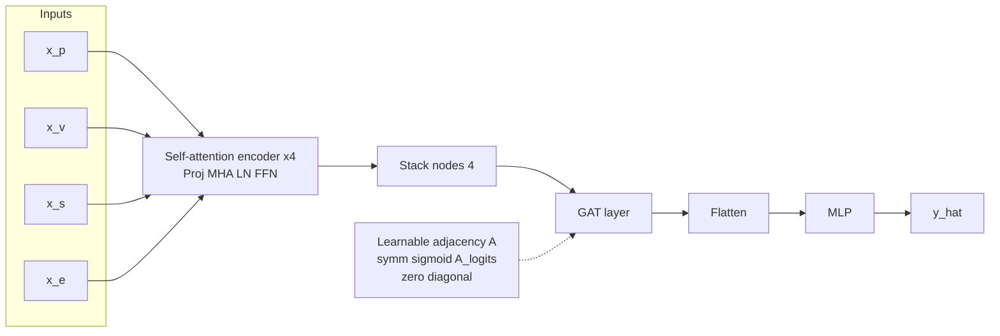

```mermaid
graph LR
  subgraph IN[Inputs]
    direction TB
    Xp[x_p]
    Xv[x_v]
    Xs[x_s]
    Xe[x_e]
  end

  ENC[Self-attention encoder x4\nProj MHA LN FFN]
  STK[Stack nodes 4]
  GAT[GAT layer]
  FLT[Flatten]
  MLP[MLP]
  OUT[y_hat]

  Xp --> ENC
  Xv --> ENC
  Xs --> ENC
  Xe --> ENC

  ENC --> STK --> GAT --> FLT --> MLP --> OUT

  ADJ[Learnable adjacency A\nsymm sigmoid A_logits\nzero diagonal]
  ADJ -.-> GAT
```
